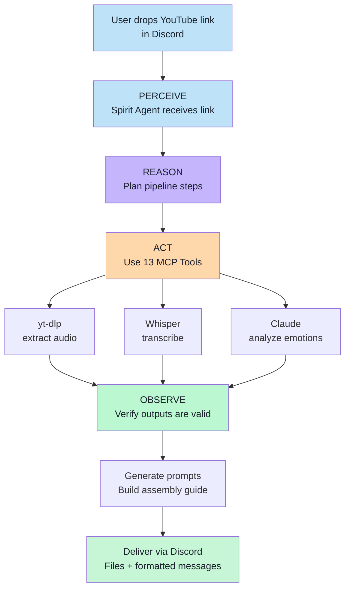

# Case Study: OpenClaw — Building a Production Multi-Agent Orchestration Framework

## Overview

OpenClaw is an open-source multi-agent orchestration framework that deploys autonomous Claude-powered agents on cloud infrastructure with Discord integration. It demonstrates every concept taught in Module 1 — at production scale.

## The Problem

A content creator needed to automate a complex pipeline: take a YouTube video, extract the audio, transcribe it, analyze the emotional arc, generate AI image and video prompts for each segment, and deliver everything back via Discord — with zero human intervention after dropping a link.

## The Agent Architecture

## Key Agentic Patterns Demonstrated

### 1. Tool-Use at Scale
The Spirit agent has access to 13 MCP (Model Context Protocol) servers, each providing different capabilities:
- File operations (read, write, move)
- Web scraping and data extraction
- Database access
- API integrations
- Audio/video processing

### 2. Autonomous Decision-Making
The agent decides:
- Which tools to use for each step
- How to handle errors (retry, skip, alternate approach)
- When the pipeline is complete
- How to format output for the user

### 3. Memory Integration
- **Short-term:** Conversation context within a pipeline run
- **Long-term:** Workspace files persist between sessions
- **Skill memory:** Agent instructions (SOUL.md) define behavior patterns

### 4. Multi-Agent Coordination
OpenClaw supports multiple agents, each with different skills:
- Spirit agent handles content processing
- Other agents handle different domains
- Agents can delegate sub-tasks to each other

## Results

- **Pipeline runs autonomously** end-to-end with zero human intervention
- **Processing time:** ~3 minutes for a 10-minute YouTube video
- **Output quality:** Production-ready prompts used to generate actual content
- **Reliability:** Handles errors gracefully, retries failed steps

## Lessons Learned

1. **Start simple, add tools incrementally** — The first version had 3 tools. Now it has 13. Each was added when a real need emerged.
2. **The agent loop is everything** — Every feature maps back to perceive → reason → act → observe.
3. **Tool design matters more than prompt engineering** — Well-defined tools with clear descriptions let the agent figure out the rest.
4. **Memory is the differentiator** — Stateless agents are demos. Stateful agents are products.
5. **Human-in-the-loop is a feature, not a limitation** — The best agents know when to ask for help.

## Connection to Module 1

| Module 1 Concept | OpenClaw Implementation |
|------------------|----------------------|
| Agent Loop | Spirit agent runs perceive → reason → act → observe continuously |
| Tool-Use | 13 MCP servers providing real-world capabilities |
| Memory | Workspace files + conversation history + SOUL.md instructions |
| Planning | Claude reasons about pipeline steps before executing |
| Evaluation | Output validation at each step, error handling, retry logic |
| When NOT to agent | Simple file moves use scripts, not agent reasoning |
