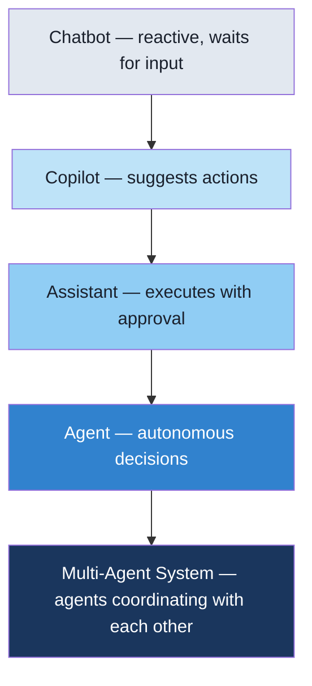
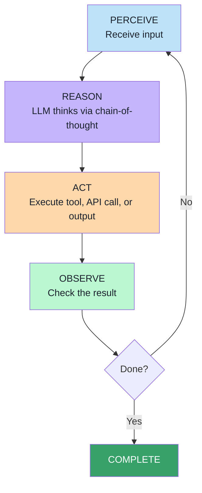
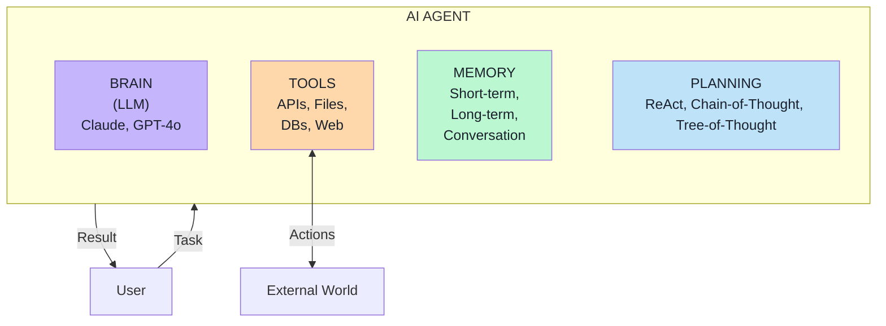
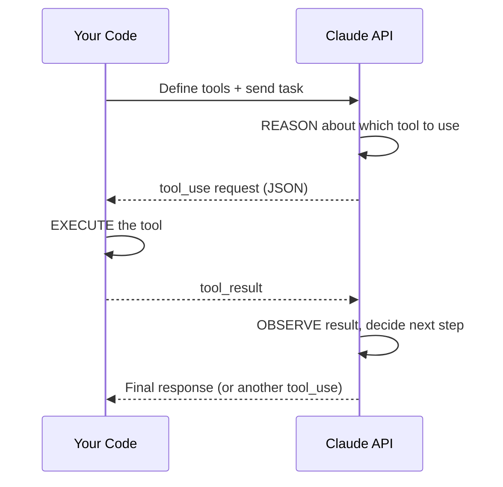
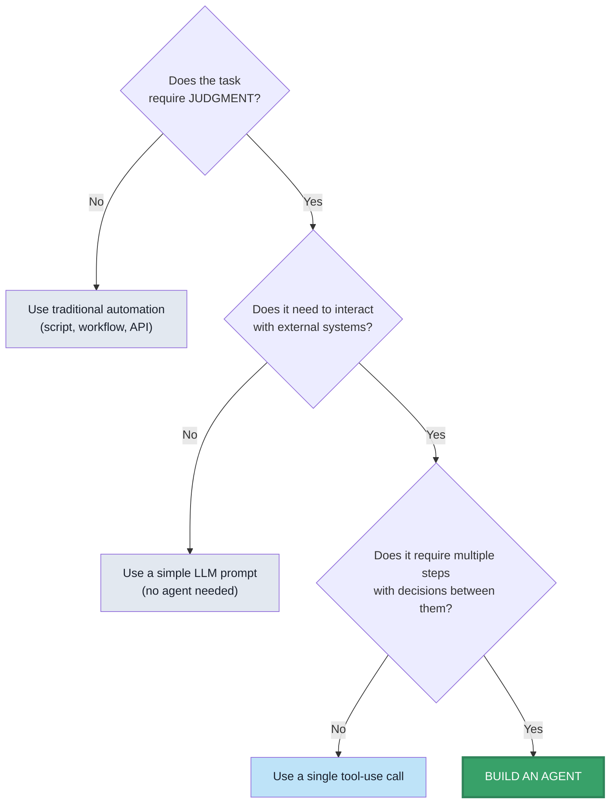

# Module 1 Curriculum: Foundations of Agentic AI

## Section 1: The Agentic AI Mental Model

### 1.1 — What Is an AI Agent? (15 min)

**Key Concept:** An AI agent is a system that uses an LLM as its reasoning engine to autonomously perceive its environment, make decisions, take actions, and learn from the results — without step-by-step human instruction.

**Instructor Talking Points:**
- Start with what it's NOT: it's not a chatbot (reactive), not RPA (scripted), not a workflow engine (deterministic)
- An agent DECIDES what to do next. A chatbot waits for you to ask. That's the fundamental difference.
- Analogy: A chatbot is like a customer service phone tree. An agent is like a new employee who reads the manual, figures out what needs to be done, and does it.

**The Autonomy Spectrum:**

**Discussion Question:** "Think about your daily work. Name one task where you follow the exact same steps every time (automation candidate) and one where you have to make judgment calls (agent candidate)."

---

### 1.2 — The Agent Loop (15 min)

**Key Concept:** Every AI agent follows the same fundamental loop, regardless of complexity.

**Instructor Note:** Draw this on the whiteboard. Every lab in this module maps back to this loop. Students should be able to identify each phase in their own agents by the end.

---

### 1.3 — What Agents Can and Can't Do (15 min)

**Good Fit for Agents:**
| Use Case | Why It Works |
|----------|-------------|
| Research & summarization | Open-ended, requires judgment, benefits from tool use |
| Data analysis & reporting | Multi-step, requires reasoning about what to analyze |
| Customer support triage | Needs to understand intent and route appropriately |
| Code generation & review | Requires context awareness and iterative refinement |
| Content creation workflows | Benefits from planning, drafting, and revision |

**Bad Fit for Agents (Use Traditional Automation Instead):**
| Use Case | Why It Doesn't Work |
|----------|-------------------|
| Sending a scheduled email | Deterministic — no reasoning needed |
| Moving files between folders | Simple rule — use a script |
| Database backups | Cron job, not an agent |
| Form validation | Regex/rules, not LLM inference |
| Real-time trading execution | Latency-critical — agents are too slow |

**Key Takeaway:** "If you can write an if/else statement for it, don't use an agent. Agents are for tasks that require JUDGMENT."

---

## Section 2: Anatomy of an AI Agent

### 2.1 — Core Components (20 min)

**The Four Pillars of an AI Agent:**

1. **Brain (LLM):** The reasoning engine. Claude, GPT-4o, Gemini — this is what thinks.
2. **Tools:** How the agent interacts with the outside world. APIs, file systems, databases, web browsers.
3. **Memory:** How the agent remembers. Conversation history, persistent storage, vector databases.
4. **Planning:** How the agent decides what to do. ReAct pattern, chain-of-thought, tree-of-thought.

---

### 2.2 — Tool-Use Pattern Deep Dive (15 min)

**Key Concept:** Tools are what transform an LLM from a "text predictor" into an "agent that acts."

**How Tool-Use Works (Claude API):**

**Example Tools an Agent Might Have:**
- `search_web(query)` — Find information online
- `read_file(path)` — Read a document
- `send_email(to, subject, body)` — Take action in the real world
- `query_database(sql)` — Access structured data
- `calculate(expression)` — Perform math

**Instructor Note:** This maps directly to Lab 2. Students will define their own tools and see the agent use them autonomously.

---

### 2.3 — Memory Types (10 min)

| Memory Type | What It Is | Example |
|-------------|-----------|---------|
| **Conversation** | Current chat history | "You asked me to research X" |
| **Short-term** | Context window contents | Last 10 messages + tool results |
| **Long-term** | Persistent storage | Files, databases, vector stores |

**Key Insight:** Most "agents" today only have conversation memory. True agentic systems need long-term memory to learn and improve over time.

---

## Section 3: Hands-On Labs

### Lab 1: Hello Agent — Claude API Basics (30 min)
- Set up Claude API key
- Make first API call
- Parse structured responses
- Understand message roles (user, assistant, system)
- **Outcome:** Working Python script that talks to Claude

### Lab 2: Tool-Use Agent (30 min)
- Define 3 tools (calculator, current time, word counter)
- Send a task that requires tool use
- Handle tool_use response and return tool_result
- Watch the agent reason → act → observe
- **Outcome:** Agent that autonomously decides which tool to use

### Lab 3: Multi-Step Agent with Memory (30 min)
- Build an agent loop that continues until task is complete
- Add conversation memory (message history)
- Implement a simple file-based persistent memory
- Give the agent 5+ tools and a complex task
- **Outcome:** Agent that plans, executes multi-step workflows, and remembers

---

## Section 4: How Do You Know Your Agent Works?

### 4.1 — Agent Evaluation Framework (15 min)

**The Three Pillars of Agent Evaluation:**

| Pillar | Question | How to Measure |
|--------|----------|---------------|
| **Accuracy** | Does it produce correct results? | Compare output to known-good answers |
| **Reliability** | Does it work consistently? | Run the same task 10x, check variance |
| **Safety** | Does it avoid harmful actions? | Red-team with adversarial prompts |

**Evaluation Checklist for Any Agent:**
- [ ] Does it complete the task it was given?
- [ ] Does it use the right tools for the job?
- [ ] Does it handle errors gracefully?
- [ ] Does it know when to stop?
- [ ] Does it ask for help when uncertain?
- [ ] Does it refuse harmful or out-of-scope requests?

---

### 4.2 — When NOT to Use an Agent (15 min)

**The Anti-Patterns:**

1. **Deterministic tasks** — If the steps never change, use a script
2. **Latency-critical operations** — Agent reasoning adds 1-5 seconds per step
3. **High-stakes without human review** — Don't let agents send money or delete data unsupervised
4. **Simple CRUD operations** — An API endpoint is faster and cheaper
5. **Tasks requiring perfect accuracy** — Agents hallucinate; critical calculations need verification

**The Decision Framework:**

---

## Section 5: Capstone Project

See `capstone.md` for full project brief, requirements, and evaluation rubric.

**Summary:** Build a Personal Research Agent that:
1. Takes a topic from the user
2. Generates 3-5 research questions
3. Uses tools to search for information
4. Synthesizes findings into a structured report
5. Saves the report to a file
6. Evaluates its own confidence in the findings
