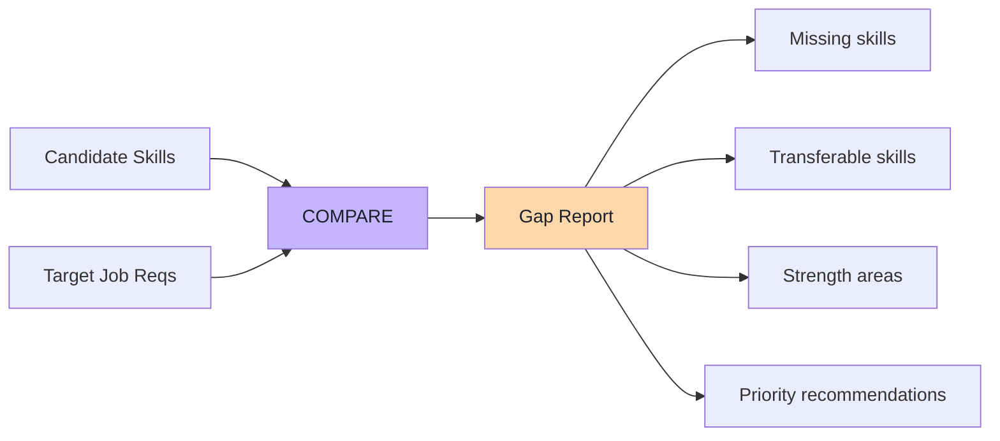
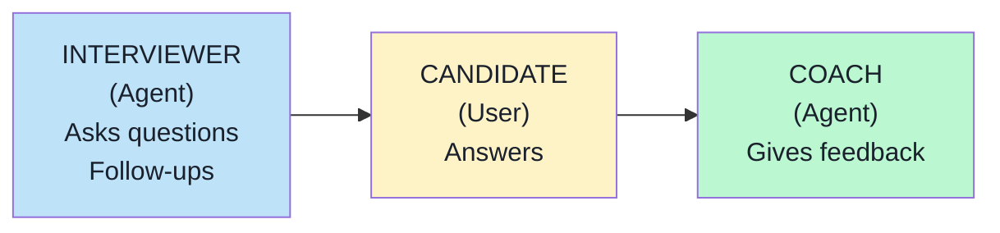
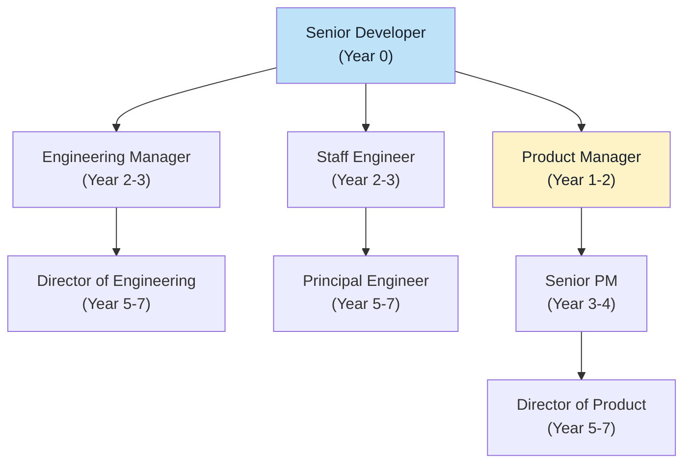
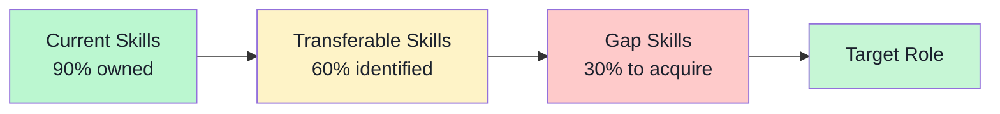
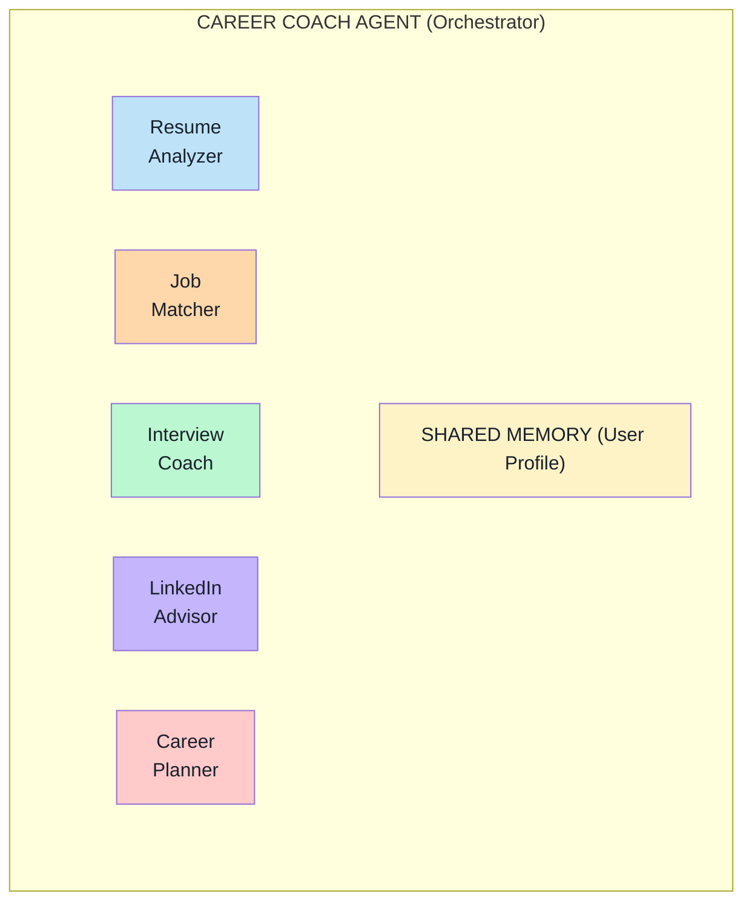

# Module 2 Curriculum: AI Agents for Professional Development

## Section 1: Resume Analysis & Optimization Agent

### 1.1 — The Resume as Structured Data (15 min)

**Key Concept:** A resume is unstructured text that encodes structured information — contact details, work history, skills, education. The first job of a resume agent is to extract this structure reliably.

**Instructor Talking Points:**
- Resumes come in wildly different formats — yet they all encode the same core fields
- LLMs excel at this extraction because they understand semantic meaning, not just pattern matching
- An agent can do what traditional parsers can't: infer implied skills, understand context, handle ambiguity

**Data Model for a Parsed Resume:**
```python
{
    "contact_info": {"name", "email", "phone", "location", "linkedin"},
    "summary": "str",
    "work_experience": [
        {"company": "str", "title": "str", "dates": "str", "bullets": ["str"]}
    ],
    "education": [
        {"institution": "str", "degree": "str", "field": "str", "year": "int"}
    ],
    "skills": {
        "technical": ["str"],
        "soft": ["str"],
        "tools": ["str"],
        "certifications": ["str"]
    },
    "metadata": {"years_experience": "int", "career_level": "str", "industries": ["str"]}
}
```

---

### 1.2 — Skills Taxonomy and Gap Analysis (15 min)

**Key Concept:** Raw skill extraction is step one. The real value is mapping those skills against a target — a specific job, an industry standard, or a career goal.

**Gap Analysis Pattern:**


**Discussion:** "If you were hiring for your own team, what skills would you look for that AREN'T usually listed in job descriptions?"

---

### 1.3 — ATS Optimization (15 min)

**Key Concept:** 75%+ of resumes are filtered by Applicant Tracking Systems before a human sees them. An optimization agent checks for:

| Factor | What to Check | Why It Matters |
|--------|--------------|----------------|
| Keywords | Match job description terms | ATS uses keyword matching |
| Format | Clean sections, standard headings | ATS needs to parse structure |
| Quantification | Numbers in bullet points | Shows measurable impact |
| Length | Appropriate for experience level | Too long = skimmed, too short = thin |
| Consistency | Date formats, tense, style | Professional attention to detail |

---

### 1.4 — Lab 1: Resume Analyzer Agent (30 min)

Students build an agent with these tools:
- `parse_resume(text)` — Extract structured data from resume text
- `analyze_skills(skills, target_role)` — Gap analysis against a target role
- `score_ats_compatibility(resume_text, job_description)` — ATS optimization score
- `suggest_improvements(parsed_resume, analysis)` — Actionable recommendations

**Outcome:** Agent that takes raw resume text + target role and produces a detailed analysis report.

---

## Section 2: Job Search & Matching Agent

### 2.1 — Job Description Parsing (15 min)

**Key Concept:** Job descriptions are the mirror image of resumes — they encode requirements, responsibilities, and company information in unstructured text. Parsing both sides enables matching.

**Parsed Job Description Schema:**
```python
{
    "title": str,
    "company": str,
    "location": str,        # or "remote"
    "salary_range": {min, max, currency},
    "requirements": {
        "must_have": [str],  # Required skills/qualifications
        "nice_to_have": [str],
        "experience_years": int,
        "education": str,
    },
    "responsibilities": [str],
    "benefits": [str],
    "culture_signals": [str],  # Values, work style hints
}
```

---

### 2.2 — Multi-Factor Matching (15 min)

**The Matching Matrix:**
```
                     Weight   Candidate Score   Weighted
Skills Match:          40%        85%            34.0
Experience Level:      25%        90%            22.5
Location Fit:          15%       100%            15.0
Salary Alignment:      10%        70%             7.0
Culture Fit:           10%        60%             6.0
                              ────────────────
                              TOTAL: 84.5/100
```

**Key insight:** Not all factors matter equally. Let users set their own weights.

---

### 2.3 — Lab 2: Job Matching Agent (30 min)

Students build an agent with:
- `parse_job_description(text)` — Extract structured requirements
- `match_candidate(resume_data, job_data)` — Multi-factor matching with scores
- `rank_opportunities(resume_data, jobs_list)` — Batch ranking of multiple jobs
- `generate_application_strategy(match_result)` — Tailored advice per job

**Outcome:** Agent that takes a resume + multiple job descriptions and produces ranked matches with per-factor scores.

---

## Section 3: Interview Preparation Agent

### 3.1 — Question Generation Strategies (15 min)

**Three Types of Interview Questions:**

| Type | Purpose | Example |
|------|---------|---------|
| Behavioral | Past performance | "Tell me about a time you handled a difficult stakeholder" |
| Technical | Domain knowledge | "Explain the difference between REST and GraphQL" |
| Situational | Problem-solving | "How would you prioritize these three competing features?" |

**The STAR Framework for Behavioral Questions:**
```
S — Situation: Set the context
T — Task: What was your responsibility?
A — Action: What specifically did YOU do?
R — Result: What was the measurable outcome?
```

---

### 3.2 — Mock Interview Simulation (15 min)

**Agent Design Pattern:** The interview coach uses a **role-switching** system prompt — it plays the interviewer, then switches to coach mode for feedback.



---

### 3.3 — Lab 3: Interview Coach Agent (30 min)

Students build an agent with:
- `generate_questions(job_description, resume, question_type)` — Create tailored questions
- `evaluate_answer(question, answer, criteria)` — Score and critique responses
- `suggest_improvement(answer, framework)` — Rewrite answers using STAR method
- `research_company(company_name)` — Gather company info for preparation

**Outcome:** Interactive mock interview agent that asks questions, evaluates answers, and provides coaching.

---

## Section 4: Professional Presence Agent

### 4.1 — LinkedIn Optimization (15 min)

**Key Areas:**
- **Headline:** 120 characters that define your professional brand
- **Summary/About:** 2,600 characters max — your career narrative
- **Experience bullets:** Achievement-oriented, not task-oriented
- **Skills & Endorsements:** Strategic skill ordering
- **Content strategy:** What to post, how often, engagement tactics

**Instructor Note:** This section is conceptual — students implement it in the capstone. Show examples of before/after LinkedIn profiles.

---

### 4.2 — Personal Brand Consistency (15 min)

**The Brand Triangle:**
```
        EXPERTISE
       /         \
      /           \
NARRATIVE ─── VISIBILITY
```

- **Expertise:** What you know and can demonstrate
- **Narrative:** The story that connects your experiences
- **Visibility:** Where and how you show up (LinkedIn, GitHub, conferences)

**An agent can audit all three by analyzing resume, LinkedIn, and GitHub profiles together.**

---

## Section 5: Career Path Planning Agent

### 5.1 — Career Trajectory Modeling (15 min)

**Progression Path Template:**


**Agent capabilities:**
- Map skills to multiple career paths
- Estimate timeline based on current skill gaps
- Identify bridge roles and stepping stones
- Compare salary trajectories across paths

### 5.2 — Transition Planning (15 min)

**The Bridge Model:**


---

## Section 6: Capstone — Personal Career Coach Agent

See `capstone.md` for full project brief.

**Summary:** Build a multi-agent Career Coach that:
1. Ingests a user's resume and career goals
2. Stores their profile in persistent memory
3. Provides on-demand access to all five capabilities:
   - Resume analysis and optimization
   - Job matching and ranking
   - Interview preparation and mock interviews
   - Professional presence audit
   - Career path planning
4. Maintains context across interactions (remembers user's profile, past analyses)
5. Orchestrates between specialized sub-agents

**Architecture:**

